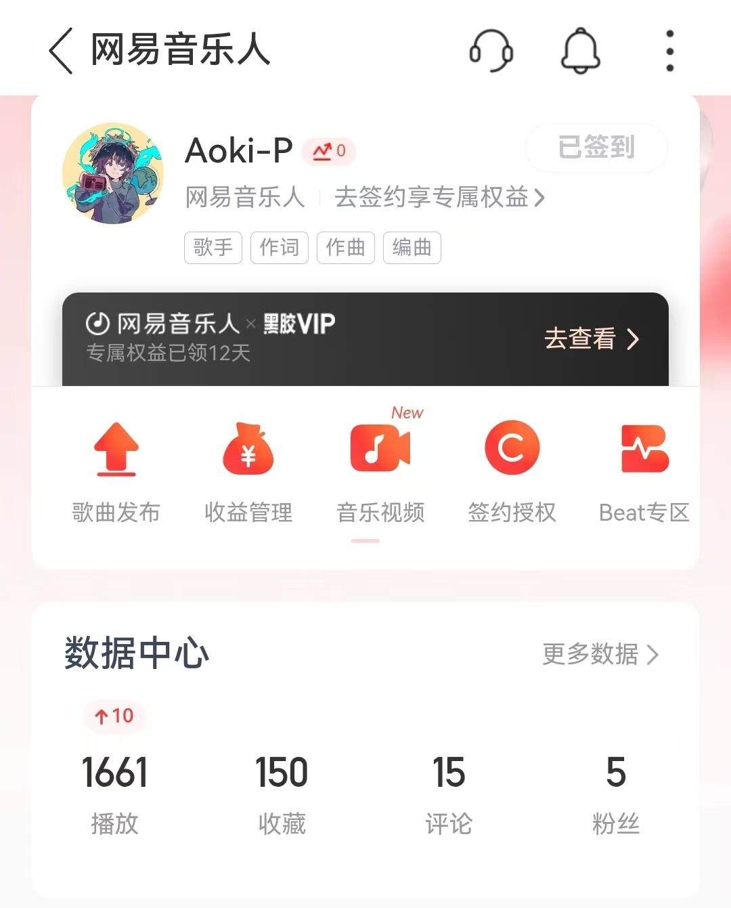
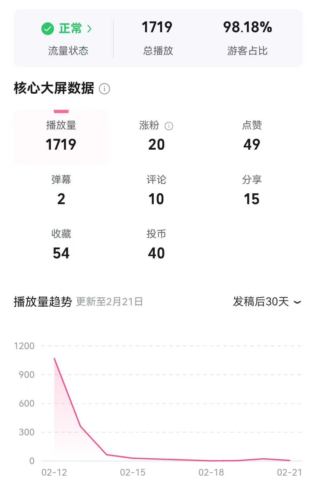
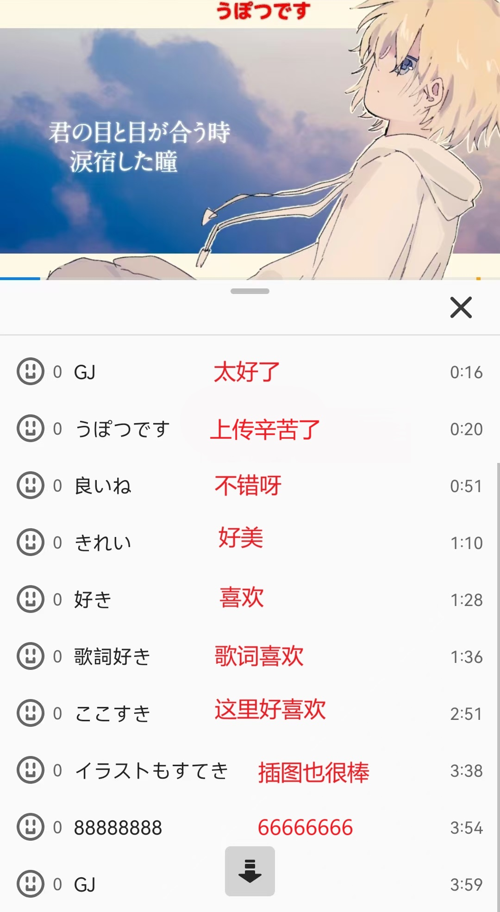

## VOCALOID P主新身份


<link rel="stylesheet" href="https://cdn.jsdelivr.net/npm/aplayer/dist/APlayer.min.css">

<meting-js
	auto="https://music.163.com/#/song?id=2672507555">
</meting-js>

 "这个春节，我在B站和网易云音乐投稿了 Vocaloid 原创曲，以 Aoki-P 的身份开启了P主生涯。" 

投稿这首曲子主要是为了~~尝试新的东西~~未成年投稿P的属性🤭。

计划在高考后（2025年6月）系统地学习编曲和混音，潜心研究引起听众共鸣的方法，找到自己的风格，然后换一个让人印象深刻的名字，再次出发。

## 对音乐的一些见解
无论怎样的风格，只要能让听众舒适、感动，得到放松、愉悦甚至从歌曲中找到自己的影子，就是好音乐。  

越来越感觉写歌和写文章大差不差。利用自己的技术和审美，打磨出能被喜欢的作品，二者的创作是同样的心路历程。  

营造对比是很重要的。移调带来音高的对比，配器数量的变化带来响度的对比……大多数流行音乐本质和古典交响乐一样，是“信息的盛宴”。和弦、复调形成变化多端的音程关系，在规律中创造不规律，由不稳定走向稳定，从提出问题到解决问题……节奏律动和旋律运动相结合，就创造出悦耳的旋律。这时如果再加上有情感张力或是娓娓道来的歌词，配上富有色彩抑或是简单至真的和弦进行，就能创造出让人印象深刻的信息盛宴。  

氛围音的作用很大。蝉鸣勾起悠远的夏日时光，黑胶唱片的杂音饱含对一去不返的回忆的追思，略微走调的合成器独奏让人回想起儿时生日蛋糕上的花形蜡烛……在乐曲中加入这些声音会营造独特的氛围。

## 喜欢的VOCALOID P主
|名字|印象|
|--|--|  
|[Neru](https://music.163.com/#/artist?id=546614)|流行朋克和术力口结合第一人。|  
|[*Luna](https://music.163.com/#/artist?id=12323325)|术曲创作组合。びび的调教第一次听时，对其呼吸音、怒音、滑音的使用印象深刻。|  
|[傘村トータ](https://music.163.com/#/artist?id=30828483) |温柔抒情曲，高超键盘力。|  
|[Orangestar](https://music.163.com/#/artist?id=1072042) |最早接触的P主，夏天感，低龄触，信仰摩门教，在美国生活过。|  
|[羽生まゐご](https://music.163.com/#/artist?id=12741288) |温柔和风。|  
|[カンザキイオリ](https://music.163.com/#/artist?id=15250024)| 故事感夏曲。|  
|……| ……|  

一人一首代表作：
<meting-js
 server="netease" type="playlist" id="13356030364">
</meting-js> 
## 本站的未来

之前一年忙于学业，加上寄宿生的身份，打理网站的时间少之又少，所以断更了差不多一年。不过，接下来的日子里，从六月份开始，网站将**恢复正常状态**。届时，我将会把一些乐理、编曲、混音方面的知识心得分享在网站上；大学入学后，我会把在学习过程中获得的体会写成文章，把本站打造成一个**技术型博客**。“说说”将会关闭，生活动态等非技术类内容将转移到网易云音乐笔记和 Bilibili BB空间🐶动态之类的平台。

正式成为一名业余P主后，会多一个网络身份，或许也会得到很大的群众关注度。因此，本次更新的同时去除了原有的本名、个人信息（防止被开盒），在想好作为P主的正式名称后，还会移除 Karlukle 这一难记而且没有实际意义的名称属性，把新名称作为线上活动的唯一标识名。本站的域名也会因此改变。

音乐站也将重新改组，精简分类，并和我的网易云音乐歌单绑定，再加一栏“我的原创音乐”。

同时，本站还会移除一些依赖后端的东西，比如点击量显示。由于Leancloud日渐不稳定，正在考虑把评论系统迁移到其他平台上。

本站是个三语网站……鉴于本人日语水平十分有限，翻译长文会吐血其实是因为没有日语读者，以后主要更新中文（尽量同步更新英文），等本人日语水平到达一定高度再恢复日文更新。

## 关于ICP备案
本站ICP备案已经一年了，对此我的看法是：别备了，没用  
ICP备案确实能给网站带来一些好东西，比如上百度的能力、国内CDN加速的权利……但是，ICP备案大多是和服务器绑定的，理论上，站点必须建在服务器上才能备案。对于像本站一样的部署在Vercel上的静态网站，备案是挂羊头卖狗肉行为。更何况百度由于满屏的广告和不备案不收录的规定已搜不到什么有用的东西，而且有Vercel自带的CDN已经足够。所以对学生博主来说，ICP备案是费时、费力、费钱的东西，也不一定会有好的结果。

## 平台数据（截至当日）

我的曲子首先发布在网易云音乐上。没想到短短几天时间播放量就破千（可能是虚拟歌姬引流作用）。
歌曲的PV发布在B站上，获得了 1700 余个播放量。    
这里就要吐槽一下腾讯音乐人和QQ音乐。对VOCALOID职人极度不友好，歌曲不能签约，根本没有流量，与客服沟通困难   
PS: 网易云音乐人的永久会员用起来很香🍉。  

昨天日本的 Niconico 搞术曲活动，遂投至N站。竟有约 10 条弹幕。↑歌词收获母语者的赞赏😂 

## 下一篇文章的内容预测
这样没有主题、放在其他平台上都不会有人看的杂文，放在博客上是再好不过了。以后这样的东西都会只发在博客上。☺️  

下一篇可能是个测评？🤔《6月XX日：关于为大学准备的笔电、外设、声卡、Midi 控制器、监听耳机……》  

{{< carousel images= "{微信图片_20241231125803-1.jpg,微信图片_20241231125759-1.jpg,微信图片_20241231125755-1.jpg,微信图片_20241231125743-1.jpg,微信图片_20241231125750-1.jpg}">}}
（来自新款公式 fu 的微笑）