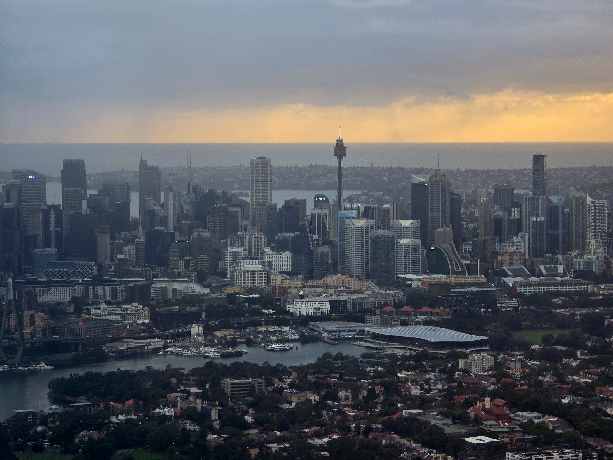
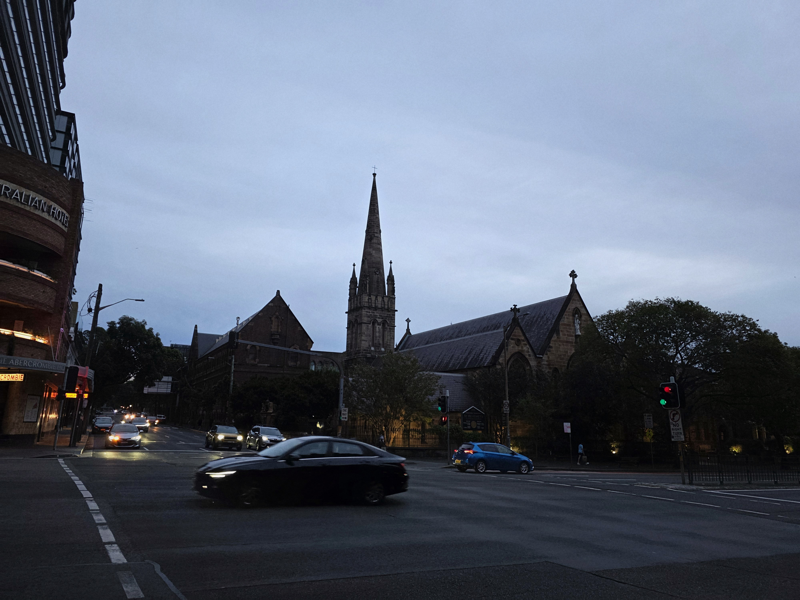

---
title: "樹海的オーストラリア之旅"
date: 2026-05-18T12:30:38+08:00
draft: false
language: zh-cn
isCJKLanguage: true
tags: [Trip,Life,ZH-CN]
---  
  

<!-- 下面是音乐播放器Aplayer↓ -->
<link rel="stylesheet" href="https://cdn.jsdelivr.net/npm/aplayer/dist/APlayer.min.css">

<meting-js
    auto="https://music.163.com/song?id=1892743037"><!--这里填网易云歌曲链接 -->
</meting-js>
<!-- 以上音乐播放器 -->

 树海老师停更博客一年有余，终于再次拿起了祂的笔。
说这树海老师自误打误撞进入某 211 大学法学部就读以降，忙于祂的学业与创作，不遗余力寻求 生業 与 hobby 之平衡。2026 年某阴雨天午後、树海老师于某 GMT+8 极北要地陋室端坐，忆其鸽时日之久，同其去年立 flag 之毅然决然，顿时惊叫，是有此文。

## 旅立ち  

   
### 家から   
冬日、2月某上午，树海老师自北半球启程。  
祂从祂辽南故乡的火车站出发，遂到着于人们称为省会的地方。  
祂看见降雪的机场，也看见天际的眩光。 


  
  
  
  


### 咸陽  
祂夜泊咸阳。刺骨的冷。不眠的夜晚。  
翌日，树海老师横越华北腹地，到着于济南。


  
  
  
  
  


### 彼方へ
树海老师于济南离岸。  
祂明白祂将跨越赤道，坠入南半球颠倒的盛夏。 


  
  
  


## 到着

### 雲越え

  
  
  
  
  

彻夜的洲际航行令树海老师疲惫。  
祂因填入境卡而污了护照；祂收下邻座お婆さん赠予的烟台苹果。  
夜明け。祂记住了南半球的一缕黎明。  


  
  
  
  
  

### 実感
树海老师穿过厚云层。  
祂在机舱里第一次看见，看见照り雨中的 Sydney。  
海境、晴雨交界。  
まるで夢みたい…まるで夢みたいだったんだ。

地面。还有能看见南十字星的大海。  
树海老师摘下耳机。祂不再悬于风中。  


  
  
  

## 漫歩
### 知らず
树海老师随手拍下很多街景。  
18°C；曇り。祂不能判断当时是拂晓还是黄昏。  

  
  
  
  
  
  
  
树海老师在没有窗子的小屋孤独入夜。  

### 晴れ  
树海老师醒来，发现自己身处夏日。  
让祂想到故乡的、蓝绿色的、干燥的夏日。  
祂走向北方的烈阳。

  
  
  
  
  
  
  
  

### 探す
树海老师踏上找寻 Opera House 的旅途。  
树海老师踏着海风之声。

  
      
    
  
树海老师停留于此，直至暮色降临。  

  

  
  
  

 *Twilight descends.*
树海老师在码头边的小酒馆里入夜。  


  
    
  

### 黙す[^disclaimer]
[^disclaimer]: ​Disclaimer: Photographic reproduction of the New South Wales Coat of Arms in this section is for non-commercial documentary purposes only. No official affiliation is claimed or implied.  

树海老师于新南威尔士州议会短暂停留。  
「咱 也好想得到一根 Mace 呢。」  
树海老师在心里如是说。  


  
  
  
  
  
  
  
  

但比起红色，树海老师果然还是更喜欢蓝绿色。  
树海老师想登上 Westfield 塔，但祂最终没有去。  

### 奈落 
树海老师来到 Taronga Zoo。  
小小的、虚妄的伊甸园。  


  
  
  
  
  
  
*↑「不屈の花」って...*  
*いやいや流石にそれはアビスの見すぎ🫣*

树海老师随后乘轮渡返回南岸。 


  
  
  
  
  
  

天色正在变暗。雲正向树海老师这边聚集。

  
  

祂去了谷子店。  

  
  
去了紀伊國屋。  


  
  
  

### 残響  
某无所事事阴雨天，树海老师乘 Lightrail 至 Moore Park。  
顺便丢失伞一把。  

  
  
  

祂围观 Hordern Pavilion。  


  
  

树海老师没能到着于 Cinematic Studio 系列音源的录制地点。  
残念。
## 帰結  

### 交差  
天气变得分外明朗了。  
树海老师乘 Bus 来到 Bondi Beach。  
祂途中偶然遇见中央大学法学部的友友。  


  
  

 「ここ、海が見えるんだね。」漂亮的海风。五光十色的温柔的大海。  
真让人内心平静呢。  


  
  
  
  
  

### 再々会  
树海老师已没有更多时间。  
祂还没有真正感觉自己属于这里。  
短くて。遅くて。

  
  
祂将启程。  
要结束了吧。  
そろそろ別れの時だな。  


  
  

依然沉郁的天空。  
「咱 会记住这里的。」  
树海老师如是说。

### 帰途  

  
  
阴雨天。  
树海老师到着于机场。  


  
  
注定从祂记忆中淡去的   
熟悉而陌生的城市剪影，  
祂从远方最后看了一眼。  

祂知道  
从这里得到的、祂体内的所有元素  
一切不属于祂的部分  
会被祂所熟悉的部分取代  
这里的蓝色的忧郁  
会被欢声笑语冲淡  
       

 さらば。   
   

  
  
很快，祂被航空器推入朗朗深空。  
祂睡去了。  
醒来时，身处江蘇。  


  
   

原路返回。  
迷雾裹挟着回家的路。  


  
   

  
—終わり—